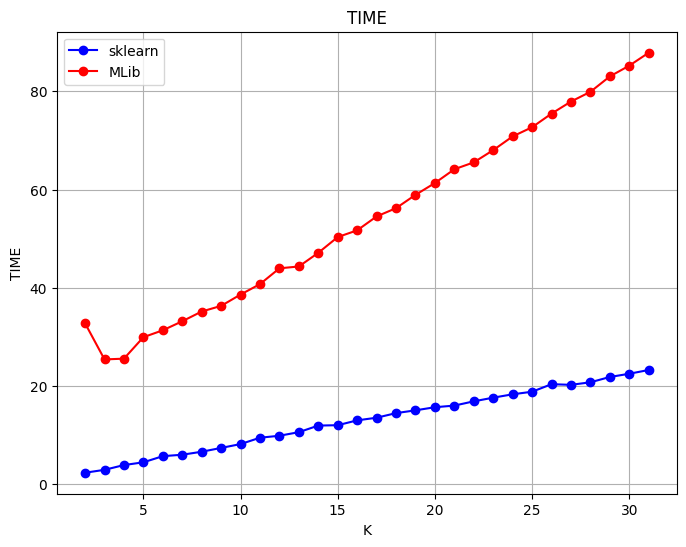
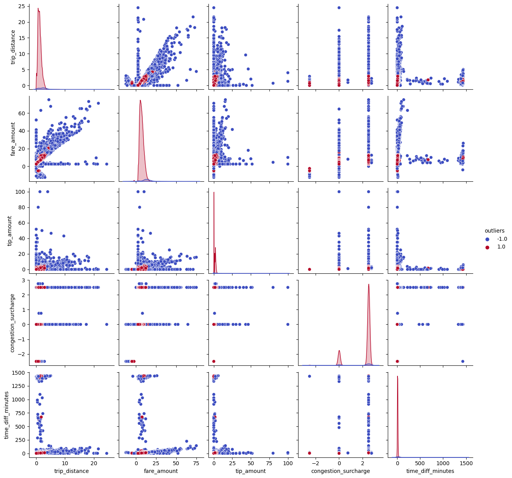
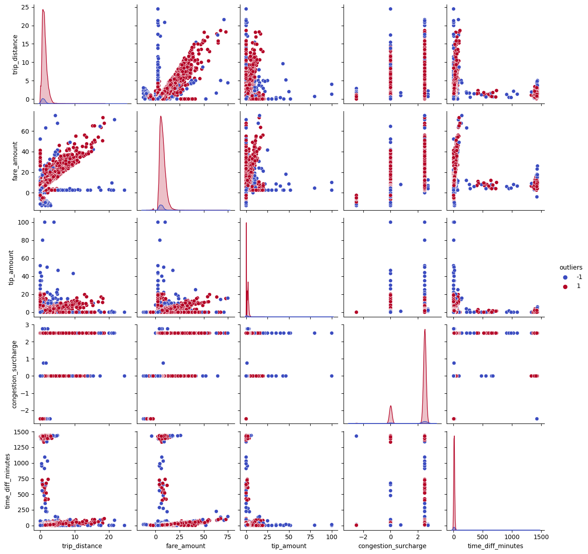
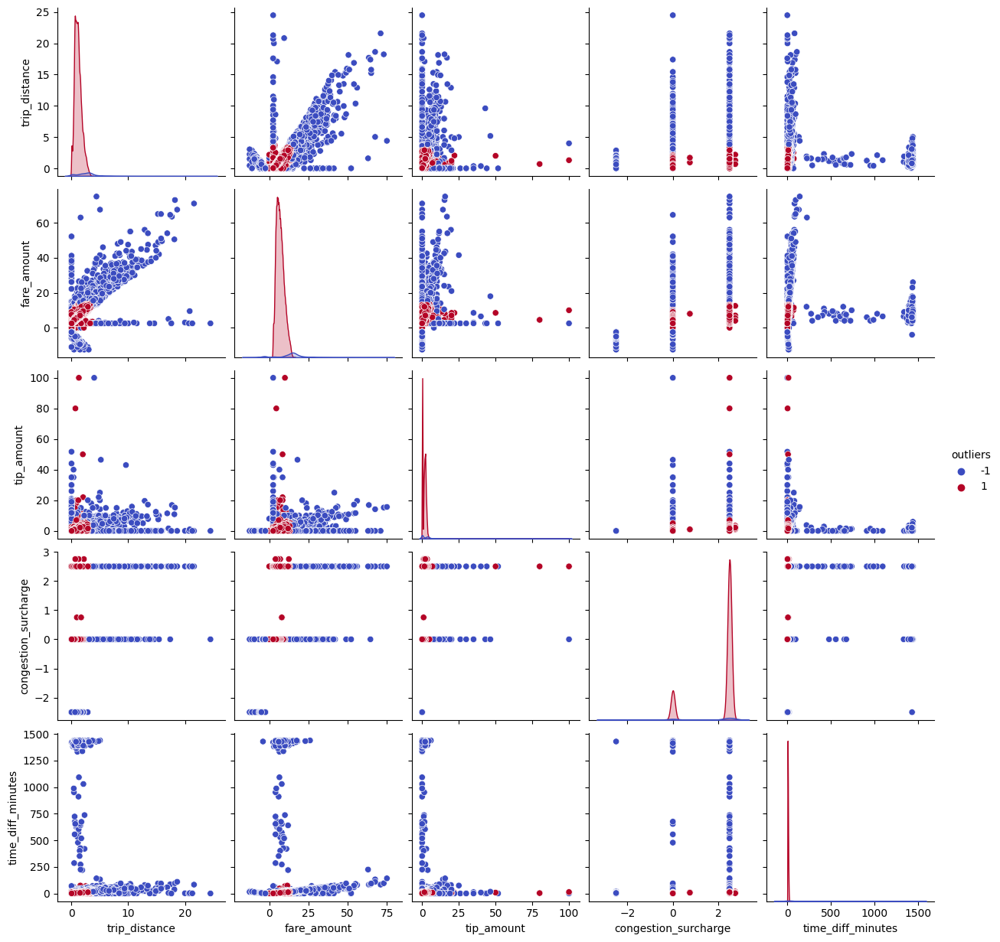
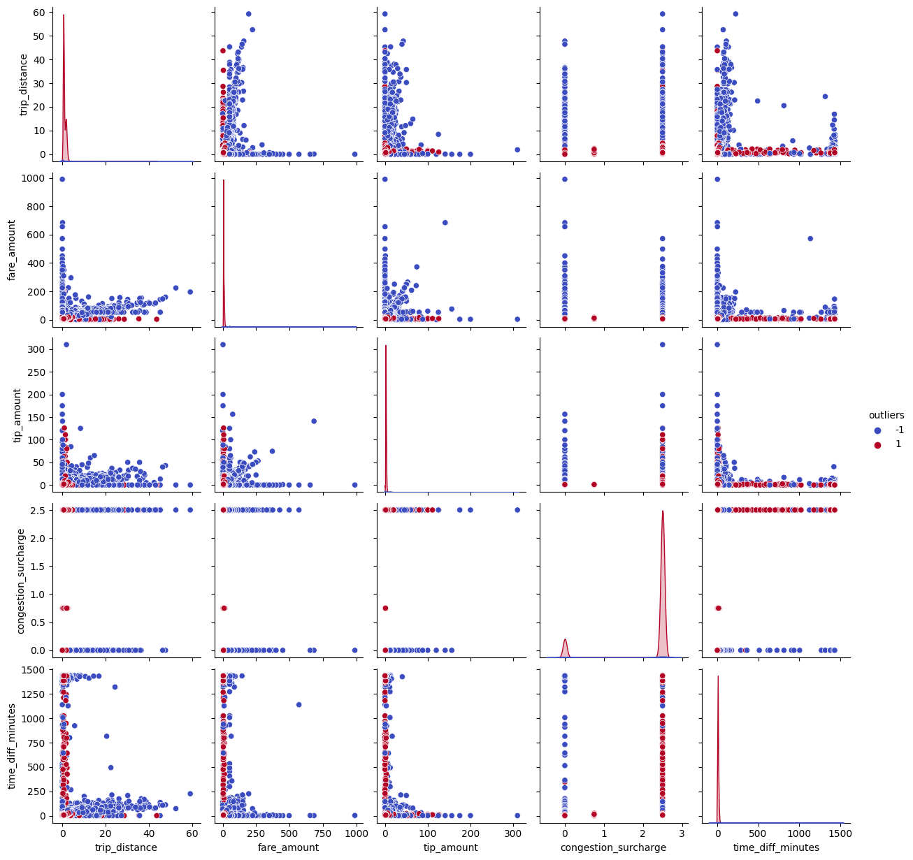
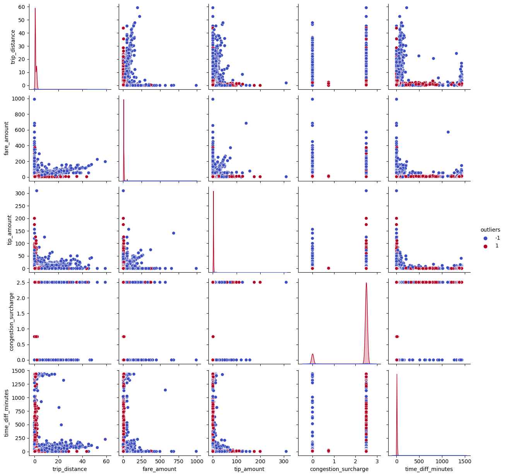

# Anomaly Detection

## Overview

Using a dataset with information on taxi trips in new york in order to compare KMEANS, LOF, and Isolation Forest models. 

- [Results](#results)
- [Data](#data)
- [KMEANS](#kmeans)
- [LOF](#lof)
- [Isolation Forest](#isolation-forest)
- [Five Datasets](#five-datasets)
- [Takeaways](#for-next-time)

## RESULTS

I have recorded pairplots and the mean and variance of both anomalies and normal points from the mdoels to help evaluate which is best.

I chose the isolation forest model as my best, here is why:
- KMEANS outperformed LOF.
    - The variability within the normal points is significantly lower for KMEANS
    - As you can see on the pairplot, the normal points for LOF are all over the place. 
- ISO and Kmeans have similar pairplots but, it took about 6s to train and fit ISO, whereas the kmeans spent 20s

So for the multiple dataset evaluation I used the Isolation Forest model. See the results [here](#five-datasets)

## Data 

Data can be downloaded using [this notebook](anomaly_detection/Download_Taxi_Dataset_from_Google_Drive_NEW_VERSION(1).ipynb)

Features:
- trip_distance
- fare_amount
- tip_amount
- congestion_surcharge
- time_diff_minutes

## KMEANS 

For the kmeans model I ran one version from the pyspark.ml library and one from sklearn to compare their performance. For both I ran them with a different k for several iterations in order to find for which k the models performed best. 

The predicted points were classified as anomalies based on z-scores and euclidean distance. 

### Results
I used a threshold equalling an anomaly percentage of about 5%. 
I evaluated my results using pairplots.

** Comparing pyspark and sklearn **

As illustrated below, sklearn is much faster. That is also true when taking into consideration it took about 4 seconds to transform the pyspark df to pandas for the sklearn model. 

Selecting k = 25 for both models absed on the elbow method. 
| Metric               | sklearn               | pyspark               |
|----------------------|-----------------------|-----------------------|
| anomalies_percentage | 1.1386803242006862    | 0.9994530356521307    |
| num_anomalies       | 1145                  | 1005                  |
| threshold           | 3                     | 3                     |
| time (s)            | 18.838303565979004    | 72.68311262130737     |

**Final** 
Choosing the sklearn model with a threshold equal to a contamination rate of 5% gives: 

**Mean and Variance of Normal and Anomaly Point**

| Feature                | Mean (Normal) | Variance (Normal) | Mean (Anomaly) | Variance (Anomaly) |
|------------------------|---------------|-------------------|----------------|--------------------|
| Trip Distance          | 0.046578      | 0.000662          | 0.103744       | 0.007902           |
| Fare Amount            | 0.221113      | 0.000901          | 0.293207       | 0.008335           |
| Tip Amount             | 0.012406      | 0.000123          | 0.024702       | 0.001642           |
| Congestion Surcharge   | 0.874621      | 0.032533          | 0.810677       | 0.051958           |
| Time Difference (min)  | 0.005705      | 0.000764          | 0.039482       | 0.024492           |
| Outliers               | 1.000000      | 0.000000          | -1.000000      | 0.000000           |

## LOF

### Contamination factor
Using a box plot of the LOF scores you can idenitfy a suitable contamination factor. You can change the threshold until most of the datapoints are within a desired range and then you have your contamination factor.

### Results

**Mean and Variance of Normal and Anomaly Points**

| Feature                | Mean (Normal) | Variance (Normal) | Mean (Anomaly) | Variance (Anomaly) |
|------------------------|---------------|-------------------|----------------|--------------------|
| Trip Distance          | 0.050030      | 0.001130          | 0.040136       | 0.002370           |
| Fare Amount            | 0.225575      | 0.001493          | 0.210902       | 0.002242           |
| Tip Amount             | 0.013120      | 0.000161          | 0.011569       | 0.001126           |
| Congestion Surcharge   | 0.873381      | 0.032917          | 0.832036       | 0.047720           |
| Time Difference (min)  | 0.007440      | 0.002010          | 0.007683       | 0.002755           |
| Outliers               | 1.000000      | 0.000000          | -1.000000      | 0.000000           |

## Isolation Forest

For Isolation Forest I ran some experiments on its interpretability, num_estimators, and optimal contamination factor using just two features. The resutls of which are in the notebook. 

### Results

The following hyperparamter were used:
contamination = 0.05 #5%
num_estimators = 25
random_state = 42

Fit and predict time = 6.287s

As the data is not scaled for the isolation forest I did not get the variance and mean metrics. 

## Five datasets

To test how generalisable the model was I created five datasets, and combined them all into one. Then I ran the Isolation Forest model for each dataset individually as well as for them all together. Making sure I retrain the mdoel each time. If successful, the model should make similar predictions on the sum of all the individual datasets and the large one. 

Looking at the pairplots the results look very similar. 
Analysing the dataframes I find that: Number of unequal predictions 10017, out of a total of 1000000 predictions. Percentage = 1.00%

And looking at the unequal predictions they are usually for null values in trip_distance and fare_amount, so they are anomalies that can be ruled out with preprocessing. 

**Results all five at once**

**Results the five small datasets concatenated**

## For next time

- %run /Anomaly_detection/utils
    - You can use this to run a different notebook from a notebook. Meaning, it will allow you to utilise functions in a different notebook. However, it is not available for the comunnity edition. 

- Do more investigations on the datapoints that were found to be anomalies. It is difficult to find any ground truths when doing the anlaysis so investigation into the anomalies is where the value can be found. 
