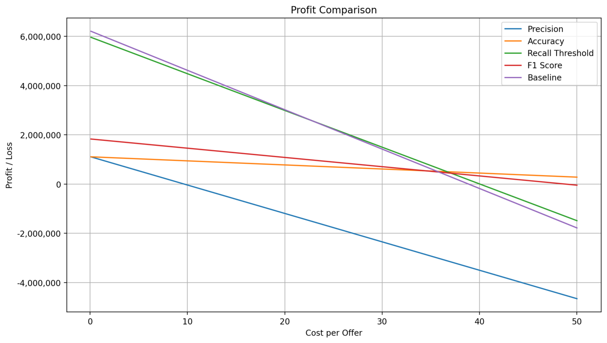
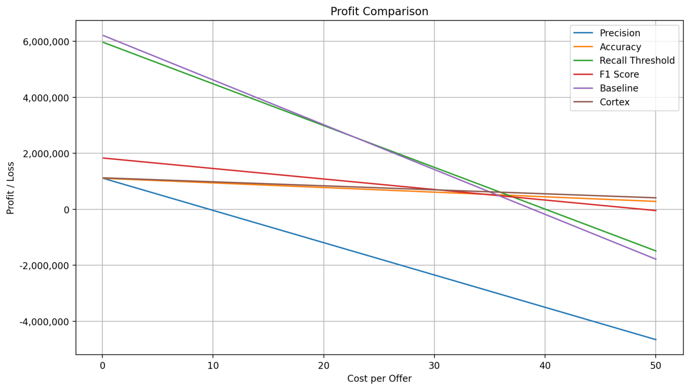

# Project 1 - Classification

## Overview

Note, all code provided for this project are jupyter notebooks downloaded from snowflake. As such, they include functions exclusive to snowflake and are not possible to run outside of a snowflake environment. 

Snowflake compute wh size = XS

**Table of Contents**
- [Cortex Classification](#cortex-classification)
- [Data Overview](#brief-overview-of-the-data)
- [Model Registry](#model-registry)
- [KPI](#kpi)
- [Snowflake Experience](#snowfalke-experience)

----

## Brief overview of the data

The data comes from a Kaggle competition called "[Acquired Shoppers Challenge](https://www.kaggle.com/competitions/acquire-valued-shoppers-challenge/data)". 
It includes retail store data on a number of companies and brands. I used the three files transactions.csv, trainHistory.csv, and offers.csv. They included transaction data on customers, history of offers given to customers and whether they returned or not, and lastly information about the offers. The objective of the project was to predict whether a customer would return to the store upon receiving a certain offer. 

It is a large dataset of about 22GB and I used snowflake to manage and interact with all the data. 

**Schemas:**  
_history_ 
**id** - A unique id representing a customer  
**chain** - An integer representing a store chain  
**offer** - An id representing a certain offer  
**market** - An id representing a geographical region  
**repeattrips** - The number of times the customer made a repeat purchase  
**repeater** - A boolean, equal to repeattrips > 0  
**offerdate** - The date a customer received the offer

_transactions_ 
**id** - see above  
**chain** - see above  
**dept** - An aggregate grouping of the Category (e.g. water)  
**category** - The product category (e.g. sparkling water)  
**company** - An id of the company that sells the item  
**brand** - An id of the brand to which the item belongs  
**date** - The date of purchase  
**productsize** - The amount of the product purchase (e.g. 16 oz of water)  
**productmeasure** - The units of the product purchase (e.g. ounces)  
**purchasequantity** - The number of units purchased  
**purchaseamount** - The dollar amount of the purchase

_offers_ 
**offer** - see above  
**category** - see above  
**quantity** - The number of units one must purchase to get the discount  
**company** - see above
**offervalue** - The dollar value of the offer  
**brand** - see above

## KPI

So to evaluate the effect the implementation of this machine learning model would have one the business itself I need to define a KPI. In this case I am using profit as the kpi. This allows me to establish the estimated profit they recevied from sending out offers to random customers, vs sending out offers to an equal amount of customers selected by my machine learning model. 

I am making the assumption that the cost per offer of something like this woudl be fairly low, but I will get results with various values to compare when it is the most beneficial to use the model. 

### Performance Metric

To optimise for my KPI I have to select a performance metric for the model. That means what metric I use to evluate and train it on such that it maximises the KPI. 

Here I can pick between accuracy, recall, f1, and precision, and they would all change the resulting KPI.

**Recall**

 True Positives / (False Negatives + True Positives)

 I initally decided to use recall. The thought was that the cost per offer was low. So I did not really care about False Positives. Meaning that if the model decided to predict many False Positives it would have very little impact on the KPI. The problem with recall is that it does not care about TN. So I don't improve the KPI through a lower cost by more accurately targeting customers. A recall optimised model would have a hard time outperforming the baseline which is to give offers to about 50% of the customers, 30% of which will return. <todo> Test this </todo>

**Precision**

 (True Positives) / (True Positives + False Positives)

 The formual above indicates that a model trained using precision as the performance metric would attempt to maximise the number of true positives and minimise the number of false positives. So it is trying to be "precise" in that it wants to accurately predict when a customer will return with a high degree of certainty. This means that it might be able to more efficiently be able to identify the majority of the customers that would return upon receiving an offer. That being said it is more likely than recall to miss some true positive cases. 

**Accuracy**

 Accuracy = (True Positives + True Negatives) / (True Positives + True Negatives + False Positives + False Negatives)

 As the formula tells us, a model trained for accuracy attempts to maximise the number of true predicitons. Both true negatives and true positives. Compared to recall, it will have less cases of False Positives, and compared to precision it will have less cases of False Negatives. Meaning that overall it will be more accurate, but might suffer compared to recall if the cost of a FP is low or compared to precision if cost of FP is high. 

**F1 Score**

 2 * (Precision * Recall) / (Precision + Recall)

 It combines precision and recall. If either is low, the F1 score is low, if both are high the f1 score is high. 

In summary, which metric a model should be guided by is, in this case, very dependent on the cost of sending out an offer. As I am unsure about what that cost is I have decided to provide a range of values and see for which costs each model performs best.

**Results**

I calculated the profit by finding a value_of_returning_customer nuber based on the avereage spend per shop and the average number of repeattrips. The profit for a model would then be number of true positives times the value_of_returning_customer minus all the positive predictions times the cost_of_offer.
After running this for a ranging cost on all models I found that they are better in different scenarios. As you can see on the chart, from 0.5 to around 23 dollars cost per offer, the baseline performs best. Meaning that the default version of randomly sending out offers is best. Then my recall optimised model takes over. Next, at around cost 37 and on the accuracy model performs best. The reason for this is that the cost of offers have risen so high that it is beneficial to predict the true negatives. 

There is one error with my results that I made when desigining this experiment. Since I need the offers to predict whether a customer becomes a repeater or not, I was unable to make the prediction on the full dataset as only aroung 50% of the customers received offers. If I had been able to forsee this I could have tried to make my prediction without those features. That means that the baseline would be to randomly select 50% of the dataset. And of taht 50% around 30% were returners. However, with a precision or accuracy model I might be able to pick almost all the returners from the full dataset doubling the number of returners. This is a great usecase for these models that can be explored later. 

View the notebook I used to calculate these results here: [KPI](kpi.ipynb)

---

## Model Registry

[Notebook](model_registry.ipynb)

Link to Snowflake docs on model registry: [link](https://docs.snowflake.com/en/developer-guide/snowflake-ml/model-registry/overview#calling-model-methods)

This is a snowflake function that allows you to save your ml models when created by using the supported libraries like sklearn and pytorch. It comes with several different attributes, for example, like you can set your evaluation metrics and store relevant information with the model. 

It takes about 55s to log the model.

Interestingly there are two main methods of running inference on saved models. 

**Model.run**

Using model.run, you simply call the reference to your model. Then you use the inbuilt model.run function to run it. This means you don't load the model back into your notebook, hence the low load time. The load time here refers to the time it takes to reference the correct version of your model in the registry. You pass the function the X_test data and the specified function you wish to run, in this case "predict". It returns the predictions in around 5s

Load time: 0.45s
Prediction time: 5.10s
Total time 5.55s

**Model.predict**

In this case you load the model back into your workspace/notebook and then call model.predict like you would normally. It takes just under 6s, 5.8 ish, to load the model back into the notebook and then 0.35s to do the prediction. This method is preferable if you have to do multiple predictions in one session.  

Load time: 3.54s
Prediction time 0.36s
Total time 5.55s

## Cortex Classification

Snowflake has an "inbuilt" classification that is based on a gradient boost machine. I tried it on this classification problem in order to compare it to the performance of my manually defined models both in terms of accuracy, but also in usability and time. 

Main Takeaways:
- The data preparation is a bit inconvenient. You can use python, but it does require you to load the data into df's before creating a new table in snowflake. The second option is to use sql so a lot of the inbuilt comforts form pandas is gone, but it is definietlely doable. Either way it is not too troublesome compared to the alternative. 
- It is very simple and easy to use. 
- In terms of XAI, it has an inbuilt explainability function using SHAP, but I could not make it work despite utilising the provided code in the docs. However, it does have a feature importance function that works.
- There are inbuilt functinos to calcualte the most common performance metrics and also to calcualte probability thresholds which I found very useful. 
- A drawback with the inbuilt performance metrics is that they seem to be done on a part of the training set. I was unable to find the same metrics on the test set after making the predictions. Hence, I had to export the table to a pandas df and calculate the various metrics using sklearn. 

**Metrics**

Train time: 21
Prediction time: 10

Accuracy: 73.94%

KPI - It outperforms the best random forest accuracy optimised model in terms of profit and loss for the business. It is the best model overall after cost per offer reaches around 37 dollars. 

Read about it here: [Snowflake Cortex Classifcation](https://docs.snowflake.com/en/user-guide/ml-functions/classification)

[Snowflake notebook with my code](cortex.ipynb)

## Lazypredict results

It's useful, but very resource-intensive and time-consuming to run. Used up more or less all $400 credits running on an S Warehouse. Ran for a few hours. 

I used the results below to select RandomForestClassifier as the model to use. 

| Model                         | Accuracy            | Balanced Accuracy  | ROC AUC             | F1 Score           | Time Taken          |
| ----------------------------- | ------------------- | ------------------ | ------------------- | ------------------ | ------------------- |
| NearestCentroid               | 0.6425715356741222  | 0.6024429963505807 | 0.6024429963505806  | 0.6564043966021561 | 0.08494138717651367 |
| GaussianNB                    | 0.6515994002249157  | 0.5983896179894634 | 0.5983896179894633  | 0.6621297541370642 | 0.09207797050476074 |
| KNeighborsClassifier          | 0.7113270023741097  | 0.5619663486869398 | 0.5619663486869397  | 0.678383020006725  | 43.834614753723145  |
| BernoulliNB                   | 0.7312570286142697  | 0.5597742739418267 | 0.5597742739418267  | 0.6814532885750648 | 0.10557317733764648 |
| BaggingClassifier             | 0.7315381731850557  | 0.5569189264412695 | 0.5569189264412695  | 0.6791366591845888 | 0.6451404094696045  |
| PassiveAggressiveClassifier   | 0.6835561664375859  | 0.5569050775402822 | 0.5569050775402822  | 0.6655869668050571 | 0.15097713470458984 |
| RandomForestClassifier        | 0.7315694114706985  | 0.5567610671857744 | 0.5567610671857744  | 0.6790080041395006 | 3.2399861812591553  |
| XGBClassifier                 | 0.7315381731850557  | 0.5567037343111041 | 0.5567037343111041  | 0.6789555387745458 | 0.31449270248413086 |
| DecisionTreeClassifier        | 0.7315381731850557  | 0.5567037343111041 | 0.5567037343111041  | 0.6789555387745458 | 0.13331866264343262 |
| SVC                           | 0.7315381731850557  | 0.5567037343111041 | 0.5567037343111041  | 0.6789555387745458 | 1360.5421550273895  |
| ExtraTreeClassifier           | 0.7315381731850557  | 0.5567037343111041 | 0.5567037343111041  | 0.6789555387745458 | 0.10158371925354004 |
| ExtraTreesClassifier          | 0.7315381731850557  | 0.5567037343111041 | 0.5567037343111041  | 0.6789555387745458 | 3.810225009918213   |
| AdaBoostClassifier            | 0.7315381731850557  | 0.5566678689560766 | 0.5566678689560766  | 0.6789253089049748 | 1.8869056701660156  |
| RidgeClassifierCV             | 0.7315381731850557  | 0.5566678689560766 | 0.5566678689560766  | 0.6789253089049748 | 0.12720847129821777 |
| RidgeClassifier               | 0.7315381731850557  | 0.5566678689560766 | 0.5566678689560766  | 0.6789253089049748 | 0.08763623237609863 |
| LogisticRegression            | 0.7315381731850557  | 0.5566678689560766 | 0.5566678689560766  | 0.6789253089049748 | 0.11116838455200195 |
| LinearSVC                     | 0.7315381731850557  | 0.5566678689560766 | 0.5566678689560766  | 0.6789253089049748 | 0.23384642601013184 |
| LinearDiscriminantAnalysis    | 0.7315381731850557  | 0.5566678689560766 | 0.5566678689560766  | 0.6789253089049748 | 0.1454603672027588  |
| CalibratedClassifierCV        | 0.7315381731850557  | 0.5566678689560766 | 0.5566678689560766  | 0.6789253089049748 | 0.7068722248077393  |
| LGBMClassifier                | 0.7315381731850557  | 0.5566678689560766 | 0.5566678689560766  | 0.6789253089049748 | 0.3807377815246582  |
| QuadraticDiscriminantAnalysis | 0.38607397226040235 | 0.5450668444800567 | 0.5450668444800568  | 0.3511332126252    | 0.10405135154724121 |
| Perceptron                    | 0.7122329126577533  | 0.5270822052793005 | 0.5270822052793004  | 0.6509602160061491 | 0.17434334754943848 |
| SGDClassifier                 | 0.7275709109084093  | 0.5                | 0.5                 | 0.6128367027455206 | 0.3092503547668457  |
| DummyClassifier               | 0.7275709109084093  | 0.5                | 0.5                 | 0.6128367027455206 | 0.06411385536193848 |
| NuSVC                         | 0.3881669373984756  | 0.4629030257268911 | 0.46290302572689124 | 0.3998141972849268 | 1763.2876596450806  |

## Data Preparation

[Data Preparation](DataPreparation.ipynb)

I used sql to extract the desried features and transform them into usable data for the sklearn and Cortex models. Very straightforward. See notebook for more details. 

## Random Forest model

**Data Preparation**
- Easy to import from database into snowflake df's and then turn those into Pandas df's
- Time to run the data imports, convert to pandas df, and do the train test split was aorun 1.5s. 

**Performance Metric**
- On the assumption that the FP cost was low I chose to use recall as my main performance metric. However, as you can read about in the KPI section I also ran the models for F1, accuracy, and precision.

**Hyperparameter optimisation**
I chose to use a randomised search to optimise the models parameters. Compared to grid search I thought it made more sense because I did not have any great reasons for choosing the various values to include in the param_grid. Additionally, it is more time and cost efficient. That being said, given the training time of around 10 minutes (for each mdoel), the randomised search returned ok parameters, but did take up a lot of resources. In retrospect, it would be helpful to run the model a couple of times myself at first to identify reasonable parameters to input into the param_grid.

In all cases the models saw significant improvement with hyperparameter optimisation compared to default so it is recommended. 

**Imbalanced dataset problem**
The dataset consisted of 27% positive cases and the rest negative. To deal with this I tried undersampling, oversampling, smote, and the Random FOrest inbuilt parameter class_weight='balanced'. For recall, the models improved slightly using these methods, but mostly with class_weight='balanced'. However, the improvement was marginal and also had a negative effect on the accuracy of the model. 

In terms of training time, undersampling halved the training time, oversampling and smote was about 50% slower, and class_weight parameter had a training time close to a default model. 

**Probability thresholds**
To improve recall I looked at different probability thresholds. As expected it significantly increased the recall perfomrance from 0.29 to 0.32

[Notebook with the relevant code](RandomForest.ipynb)

## Results

Some selected results displayed

| Model Name | Accuracy | Recall | F1 | Precision | Training Time (s) | Test Time (s) |
|------------|-----------|-------|----|-----------|-------------------|---------------|
| Random Forest Optimal Recall | 0.6523491191 | 0.2956083018 | N.A  | N.A. | 62.923414946 + | 1.899834394 | 
| Random Forest Default |,0.6371048357 | 0.3255360624 | N.A  | N.A. | 32.185394287 | 1.175194263 | 
| Random Forest Optimal Recall Threshold - 0.0289 | 0.3164125953 | 0.9566563467 | N.A  | N.A. | 15.168264627 | 1.011759043 | 
| Random Forest Optimal Precision | NA. | 0.1787639032 | N.A  | 0.46873120865904994 | 20.449402094 | 0.5532448292 | 
| Random Forest Optimal Accuracy | 0.7210733475 | 0.1776172457 | 0.46825876662636035 | 0.2575442680189542 | 21.262335539 | 0.5760011673 |
| Random Forest Optimal f1 Score | 0.5548856679, | 0.5525742461 |  0.40348306610290113  | 0.3177502307793749 | 30.212080479| 1.874590874 |
| Cortex | 0.7393789829, | 0.1820393975 | N.A.| N.A. |21.0 | 10.0 |

## Model Explainability

I tried PDP, LIME, and SHAP as ways of explaining the output of my models. 

I found LIME very useful for individual predictions, however, I’d say that SHAP did just a good a job and it can also be used for global metrics. As such, if you only have time for one method I would use SHAP. I did use LIME to discover that it seemed there was a clear therhsold were the TOTAL feature would predict positive cases. Hence, I tried making it a binary feature. Unfortunately this made the models performance much worse. 

PDP was not that helpful. Most of my features were not very impactful on the models output and they were categorical. Meaning that the PD plots were hard to read and draw insights from. I added a continous variable, TOTAL, which represented the total spend of a customer. Looking at the PDP graph for this feature I could see that the model was overfitting on it. By reducing the model depth I could visually see a difference on the PDP plot and the model performance improved. So there are definitely cases where PDP can be helpful. 

Interestingly, based on the inferred feature importance from LIME, and the actual feature importance from SHAP I tried dropping the least important features, but unfortunately this significantly depreciated the models performance. 

**Feature Importance**

Comparison of SHAP and sklearn inbuilt feature importance method. This is the “best” model, so it is still overfitting on the TOTAL feature. 

| Feature                        | Rank (Feature Importance) | Importance     | Rank (SHAP) | SHAP  |
| ------------------------------ | ------------------------- | -------------- | ----------- | ----- |
| TOTAL                          | 1                         | 0.2944257161   | 2           | +0.1  |
| OFFER_VALUE_5                  | 2                         | 0.2939765013   | 1           | +0.26 |
| PREVIOUS_PURCHASE_INT          | 3                         | 0.1408925793   | 3           | +0.06 |
| OFFER_VALUE_6                  | 4                         | 0.06691896675  | 4           | +0.04 |
| OFFER_VALUE_3                  | 5                         | 0.06571482787  | 5           | +0.04 |
| PREVIOUS_PURCHASE_CATEGORY_INT | 6                         | 0.03485369637  | 6           | +0.02 |
| OFFER_VALUE_4                  | 7                         | 0.03269285364  | 9           | +0.02 |
| OFFER_VALUE_1                  | 8                         | 0.02793670566  | NA          | NA    |
| CHAIN_CAT_3                    | 9                         | 0.01294378687  | 7           | +0.02 |
| CHAIN_CAT_1                    | 10                        | 0.01104610824  | 6           | +0.02 |
| CHAIN_CAT_2                    | 11                        | 0.009993097731 | NA          | NA    |
| OFFER_VALUE_2                  | 12                        | 0.008605160148 | NA          | NA    |

[My code](RandomForestExplained.ipynb)

## Snowflake experience

As mentioned I used snowflake to manage and interact with the data. Here are some takeaways from working with snowflake for the first time:

Cost considerations:
- The real-time cost estimation.
	- When using the worksheets, costs are updated with each query in the logs so it is easy to monitor how much credits you are using. Additionally, resource monitors are able to monitor your usage and alert you.
	- When using the notebooks you have to start it before running any cells. At which point it will import all your dependencies. There is no update to your costs until you end the notebook instance. So the resource monitor is not alerting you when you reach a desired threshold, and you might be able to run everything you wanted, but then the next day you open it up and you have run out of credits. 

Notebook usability
- Some basic comforts like keyboard shortcuts etc. that you are used to from working in code editors or on jupyter notebooks don't yet exist. 
- The error handling is terrible. It is hard to debug both when writing SQL and Python as the messages often give little indication as to what failed. For SQL errors I would run them in a worksheet first to debug and then copy them over into a Notebook.
- The notebooks are somewhat unreliable in that they will stop working or throw unexplainable edits. Usually fixed by restarting the notebook.