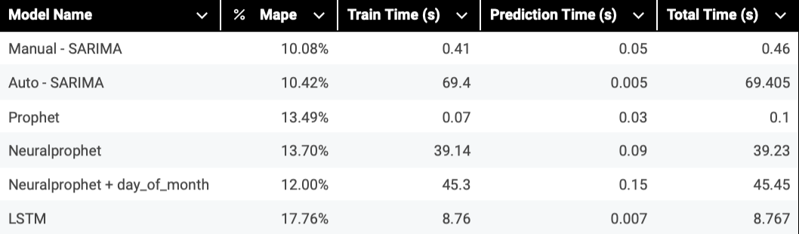
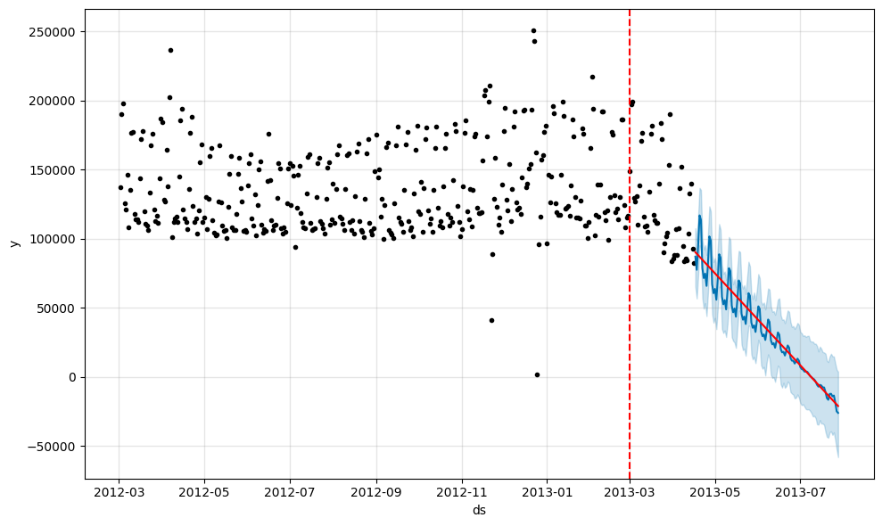
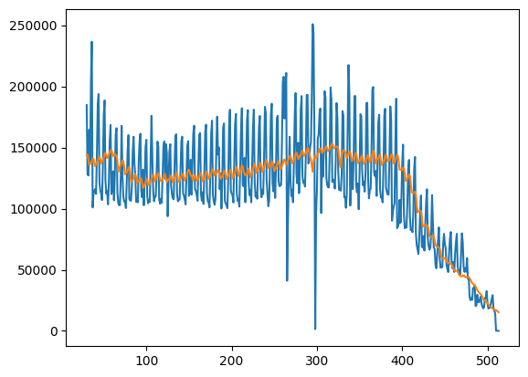
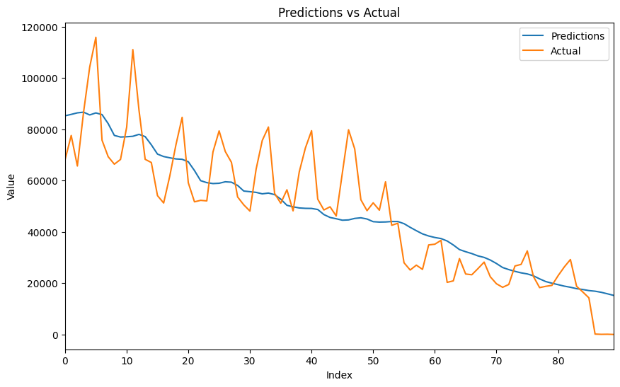

# Project 2 - Time Series Forecasting

Using the same Retail Stores dataset from Project 1, in this project I explored time series forecasting. The goal was to train a machine learning model to forecast the sales revenue into the future.

**Table of Contents**  
- [Results](#results)  
- [General Data Preparation](#general-data-preparation)  
  - [Dataset](#dataset)  
  - [Outlier Handling](#outlier-handling)  
- [SARIMA Model](#sarima-model)  
  - [Results](#sarima-results)  
- [Prophet Model](#prophet-model)  
  - [Cross Validation](#cross-validation)  
  - [Changepoint Detection](#changepoint-detection)  
- [Neural Prophet Model](#neural-prophet-model)  
  - [Changepoint Detection](#neural-changepoint-detection)  
  - [Cross Validation](#neural-cross-validation)  
- [LSTM Model](#lstm-model)  
  - [Changepoint Detection](#lstm-changepoint-detection)  
  - [Multivariate Model](#multivariate-model)  
- [Best Model, Aggregate Results](#best-model-aggregate-results)  
  - [Top 100 Companies](#top-100-companies)  
  - [Top 1000 Companies](#top-1000-companies)

## Results

Quick view at the different models performance.

## General Data Preparation

Link to dataset: https://www.kaggle.com/competitions/acquire-valued-shoppers-challenge/data

The dataset contains sales data from many different companies. I am attempting to forecast the sales for one of those companies using the models below, and then run my best model on several of the companies. 

There is one important note in the data. For all the models I have run them on two different datasets. There is missing data starting in March of the second year, indicating a changepoint. As such, the models have been trained and evaluated on the data up until that changepoint. In addition, I have for all the models trained them and evaluated them on the full time range including the changepoint. This is to check the models capability of detecting and adjusting to changepoints in time series.

An example of what the data with the changepoint looks like

For the models I do some outlier handling. I experimented with different z-scores using a histogram, like you can see in [prophet.ipynb](prophet.ipynb) in order to find the optimal one. I ended up selecting a z-score threshold of 2. I set all other values equal to the mean. 

There was a very little difference in how the model performed based on whether I dropped the outliers, sat them equal to the previous week, mean, or median. However, log transforming them produced much worse results. More here: [prophet_outlier_comparison.ipynb](prophet_outlier_comparison.ipynb). This was investigated after most models were trained. 

As you can see in the graph below, some of the spikes are removed.
Data after z-score normalisation:

## Sarima Model

Seasonal AutoRegressive Integrated Moving Average model. 
It is suitable for seasonal data like the dataset I have for this project. 

For more details, see the notebook: [SARIMA](sarima.ipynb)

**Results**

Forecasting 73 days into the future:

Manually selecting the various hyperparameters gives a
MAPE of 10.08% and took around 0.46s to fit. 

The automated SARIMA, automatically selecting the hyperparameters gives a MAPE of 10.42%. It took 69 seconds to fit and forecast with this model. 

## Prophet Model

Using Facebook's prophet model. 

Cross validation with a period of 15 days and a horizon of 15 days produced a MAPE of 11.24%. That is forecasted in 15-day intervals, totaling 120 days

Using a train test split like with the SARIMA model I get a MAPE of 13.49%

#### Changepoint Detection

**Manual Changepoint**
Providing the model the date where the data changes. When predicting on a 20% test set it gets a MAPE of 2880.7%. The dotted red line represents the changepoint date. 

**Cross Validation**

Using cross validation the model that automatically detects changepoint gets a MAPE of 150.67% when forecasting 30 days. 

The model with a manual changepoint gets a MAPE of 378.02% on the same conditions. 

Interestingly the model that detects the changepoint itself returns a list of 25 changepoints starting on the 2012-03-18, much earlier than the manually selected changepoint. 

150.67% MAPE chart:

## Neural Prophet model

Neural prophet is an extension of the prophet model that allows for multivariate datasets. When comparing it to the prophet model above (no extra features), I get the following results:

Prophet time to train + predict = 0.4s
Neural Prophet time to train + predict = 1m 15.9s
Prophet MAPE = 13.49%
Neural Prophet MAPE: 13.70%

As you can see, Neural prophet performs slightly worse with a lot longer train and predict time when compared to Prophet. 

#### Changepoint Detection

Again, comparing neural prophet to the prophet model from before. 

Prophet time to train + predict = 0.4s
Neural Prophet time to train + predict = 1m 22.2s
Prophet MAPE =  2193.88%
Neural Prophet MAPE = 1256.73%

#### Cross Validation

Using cross validation, still without any extra features it gives a MAPE of 7.13%. Meaning that it shows significant performance improvement when using cross validation also when compared to the prophet model that was able to achieve 13.7%. That being said, the cv methods are different. 

When adding an additional feature to the model, day_of_month, the simple 80/20 train test split MAPE is 9.7% beating the prophet model, however, still with a lot longer train predict time. 

## LSTM Model

For the LSTM model I had to do some additional data preprocessing. First I had to scale it using a MinMaxScaler. Then I organised the data into "windows" meaning tensors of data that would be representing 30 days worth of data. The LSTM predicts the next step. 

I also plotted the training error against epochs to decide how many epochs I should run the model for. 500 in the end.

On a similar 80/20 train test split dataset, the LSTM model achieves a MAPE of 17.76%.

#### Changepoint Detection

The LSTM model does a decent job of generalising on the changepoint data. As you can see from the charts below it is able to capture the shift in the trend. That being said, it seems to be unable to predict anything other than the trend. As you can see on the chart it continously predicts something aking to the mean. 

MAPE: 23.67%

Last 90:

RMSE: 12768.96

#### Multivariate model
Adding day of week as a feature to help it capture more of the seasonality in the data. As you can see on the graph below, it is now way better at capturing the seasonal aspect of the data, and it still does well predicting the trend. 

The MAPE is higher at 86.32%, but that does make sense as it is now daring to predict something outside of the mean.

Similarily, looking at the last 90 days, the graph looks much better visually, despite being punished on the RMSE score: 7891.54.

## Best model, aggregate results

Up until now I have only been running the models on the data from one company. Now, I will compare my best models by running them across the top 100 companies, in terms of sales revenue. Then for the prophet models I also ran them on the top 1000. The goal is to see which model would be best suited for production. 

The models I will evaluate are first the prophet with optimised parameters, the default prophet, and the neural prophet. 

When running these models on one company the neural prophet had a slightly better MAPE, but at the cost of a significantly longer train/predict time. So I will compare their results here to see which is best. 

The reason why I chose to run an optimised prophet vs a default is because I am interested to see which model best generalises across companies. 

#### Top 100 companies
The neural prophet gets an average MAPE of 22.19%.
The default prophet gets an average MAPE of 22.3%.
The optimised prophet gets an average MAPE of 33.55%.

Given the significantly larger train time for neural prophet, and only a very small increase in MAPE compared to the default prophet, I would not choose to put the model into production. 
Interestingly, the optimised prophet performs significantly worse than the default. 

#### Top 1000 companies

The defualt prophet gets an average MAPE 131.48%.
The optimised prophet gets an average MAPE of 105.5%.

Here the optimised prophet comes out ahead. It seems to me that on the top 100 companies, the optimised prophet had a couple more outliers in terms of performance compared to the default. As such, its performance was worse, but when generalised over the top 1000 companies, it is the better model. 
Training time for each of the prophet models was under 0.1s, wheras for the neural prophet it ranged from 15 to 19s. This is on an XL Warehouse with Snowflake. 

In conclusion, the optimised prophet model would be best suitable for production as it combines optimal performance, with a low cost of compute.